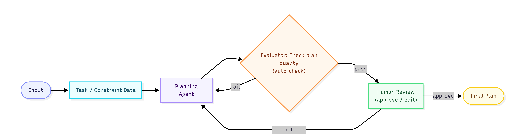
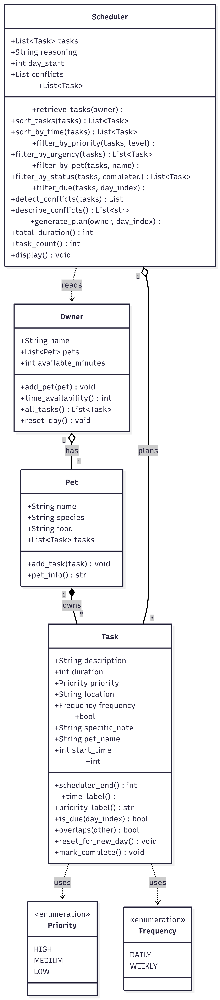

# 🐾 PawPal+

PawPal+ turns a messy pile of pet-care chores into one timed schedule you can follow from top to bottom and it never trusts the language model to get the rules right.

The interesting part of this project isn't the LLM call. It's the **verification layer around it**: a hand-written evaluator, a repair loop, a human gate, and a guaranteed fallback.

---

## Architecture Overview



Source: [`diagrams/architecture.mmd`](diagrams/architecture.mmd)

The diagram reads left to right, and the important thing about it is that **the model sits in the middle, not at the edges.** Data is filtered before it reaches Gemini, and Gemini's answer is filtered before it reaches the user.

The class model behind all of this (`Task`, `Pet`, `Owner`, `Scheduler`) is documented separately:



Source: [`diagrams/uml.mmd`](diagrams/uml.mmd)

---

## Setup Instructions
**1. Create a virtual environment (recommended)**

```bash
python -m venv .venv
# macOS / Linux
source .venv/bin/activate
# Windows (PowerShell)
.venv\Scripts\Activate.ps1
```

**3. Install dependencies**

```bash
pip install -r requirements.txt
```

### Running in Offline Mode
No API key required

```bash
streamlit run python main.py
```

### Running with Gemini
**1. Set up your API key** 
Copy the example file: 

```bash
cp .env.example .env
```

Edit .env and add your Gemini API key:
GEMINI_API_KEY=your_real_key_here

**2. Run the app**

```bash
streamlit run app.py
```

In the sidebar, select:
* Model mode: Gemini (requires API key)
* Choose a Gemini model


### Using the app in 5 steps

1. **Owner** — set your name, the minutes you actually have today, and when your day starts and ends.
2. **Add a Pet** — name, species, food.
3. **Add a Task** — pick the pet, then set a title, duration, and priority. Use **Prefer time** to pin it to a clock time (a vet visit); leave it empty and the planner finds a slot.
4. **Current tasks** — filter by pet / priority / done-state, and sort by priority or by time. Tick tasks off as you do them.
5. **✨ Suggest a schedule** — read the plan and the checker's verdict, then **Approve** it or type feedback like *"walk Ice Cream in the evening"* and ask for changes.

---

## Sample Interactions

Owner *Jordan*, day window 08:00–21:00, one dog (*Ice Cream*) and one cat (*Meo*).

| id | Task | Pet | Duration | Priority | Fixed time |
| --- | --- | --- | --- | --- | --- |
| t1 | Morning walk | Ice Cream | 60 min | High | — |
| t2 | Feed dinner | Ice Cream | 10 min | Medium | — |
| t3 | Give medicine | Ice Cream | 10 min | High | **12:00** |
| t4 | Clean litter | Meo | 15 min | High | — |
| t5 | Brushing | Meo | 15 min | Low | — |

---

### Sample 1 — The model breaks a rule, and the loop repairs it

**Input:** 200 minutes available. Owner preference: *"Ice Cream hates the midday heat."*

The model tries to honour the preference by scheduling the hour-long walk at 11:30 — which runs straight into the 12:00 medicine slot.

**Call 1 — rejected by the evaluator:**

```
[overlap] 'Morning walk' at 11:30 overlaps 'Give medicine' at 12:00
          (same pet - can't be in two places!).
```

That exact objection is fed back with the rejected plan attached.

**Call 2 — passed every check.** Approved output:

```
=== Today's Schedule (do these in order) ===
#  Time         Pet        Priority  Task           Duration  Frequency  Status
-------------------------------------------------------------------------------
1  08:00-08:15  Meo        High      Clean litter   15 min    Daily      todo
2  08:15-09:15  Ice Cream  High      Morning walk   60 min    Daily      todo
3  12:00-12:10  Ice Cream  High      Give medicine  10 min    Daily      todo
4  15:00-15:15  Meo        Low       Brushing       15 min    Weekly     todo
5  18:00-18:10  Ice Cream  Medium    Feed dinner    10 min    Daily      todo

Total: 5 task(s), 110 min
Why: The walk now finishes well before noon so it no longer runs into medicine
time. Litter opens the day, medicine keeps its fixed slot, and brushing and
dinner fill the calm afternoon and evening. (AI plan: 5 task(s), 110 min,
0 skipped, approved after 2 model calls.)
```
---

### Sample 2 — A tight budget, an accepted plan, and a warning the human has to judge

**Input:** the same tasks, but only **45 minutes** available. Total work on the table is 110 minutes, so something has to go.

**Call 1 — passed every check**, with one advisory note:

```
warning [priority_inversion] 'Morning walk' (High) was skipped while
                            'Feed dinner' (Medium) was kept.
```

**Scheduled:**

| # | Time | Task | Why |
| --- | --- | --- | --- |
| 1 | 08:00–08:15 | Clean litter | Litter box is quick and can't wait. |
| 2 | 12:00–12:10 | Give medicine | Medicine stays at its committed time. |
| 3 | 18:00–18:10 | Feed dinner | Dinner at a normal evening hour. |

**Left out of today:**

| Task | Priority | Duration | Why skipped |
| --- | --- | --- | --- |
| Morning walk | High | 60 min | An hour-long walk doesn't fit in 45 minutes; a short garden break will do today. |
| Brushing | Low | 15 min | Brushing is the least urgent job, so it waits for tomorrow. |

> **The plan:** With only 45 minutes there's no room for the hour-long walk, so the day covers the two health jobs and dinner. Litter opens the morning, medicine keeps its noon slot, dinner closes the day.

**Why this matters:** the model made a genuinely defensible trade — dropping one 60-minute High task bought two shorter jobs including medicine, which a strict priority-first rule would have gotten wrong. This is exactly the case where the LLM beats the greedy algorithm. But "skipped a High task" is also the signature of a *bad* plan, so the evaluator surfaces it as a warning and lets the owner decide instead of silently rejecting or silently accepting it. **Errors are for rules. Warnings are for judgement.**

---

### Sample 3 — The model fails three times, and the system still delivers

**Input:** 200 minutes available, but the model hallucinates a task id (`t9`) and drops four real tasks — three times running.

**Calls 1, 2 and 3 — all rejected:**

```
[unknown_task]  Scheduled 't9', which isn't one of today's tasks.
[missing_task]  'Feed dinner' was dropped without being scheduled or listed as skipped.
[missing_task]  'Give medicine' was dropped without being scheduled or listed as skipped.
[missing_task]  'Clean litter' was dropped without being scheduled or listed as skipped.
[missing_task]  'Brushing' was dropped without being scheduled or listed as skipped.
warning [no_reasoning] The plan came back with no explanation.
```

Out of attempts, the run falls back to the rule-based scheduler:

```
=== Today's Schedule (do these in order) ===
#  Time         Pet        Priority  Task           Duration  Frequency  Status
-------------------------------------------------------------------------------
1  08:00-08:15  Meo        High      Clean litter   15 min    Daily      todo
2  08:15-09:15  Ice Cream  High      Morning walk   60 min    Daily      todo
3  09:15-09:25  Ice Cream  Medium    Feed dinner    10 min    Daily      todo
4  09:25-09:40  Meo        Low       Brushing       15 min    Weekly     todo
5  12:00-12:10  Ice Cream  High      Give medicine  10 min    Daily      todo

Total: 5 task(s), 110 min
Why: Scheduled 5 task(s) using 110/200 min between 08:00 and 21:00, appointments
first, then by priority. 0 over budget; 0 had no free slot; 0 not due today;
0 conflict(s).
```

The plan is blunter — flexible tasks are packed back to back from 08:00 rather than spread across the day — but it is complete, valid, and the owner's day is covered. The UI says plainly that the AI couldn't produce a passing plan; it doesn't pretend the fallback was the AI's work.

**Why this matters:** the hallucinated id was caught by the *first* check, not by a user noticing their cat never got fed.

---

## Design Decisions

- **Verify in code, not in the prompt.** The [system prompt](prompts/planner_system.txt) states eight hard rules and the model usually follows them, but "usually" isn't good enough for a pet's schedule, so all eight are *also* Python checks in [`Evaluator`](pawpal_agent.py#L338).
  *Trade-off:* the rules live in two places and could drift apart. The tests assert against the code, so the code is the source of truth and the prompt is just a hint.

- **Filter the data before the model sees it.** Recurrence and done-state are deterministic, so the model is never asked about them — [`candidate_tasks()`](pawpal_agent.py#L162) resolves them first and hands over only what's plannable today.
  *Trade-off:* the model loses context it might have used well. In exchange, a whole category of failure — reviving a finished task, inventing a due date — becomes impossible instead of just unlikely.

- **Repair with specific objections, not "try again."** A rejected plan goes back with the plan itself *and* a numbered list of what broke ([`planner_repair.txt`](prompts/planner_repair.txt)); `'Morning walk' at 11:30 overlaps 'Give medicine' at 12:00` is actionable in a way "invalid schedule" is not.
  *Trade-off:* up to 3× the cost and latency, kept down with `gemini-2.5-flash` and `temperature=0.2` — planning wants consistency, not creativity.

- **Errors reject; warnings inform.** Overlapping tasks is a fact, and facts get rejected. "You skipped a High-priority task" *looks* like a bug but was the right call in Sample 2, so it becomes a note for the owner.
  *Trade-off:* a warned-about plan can still be approved, so nothing stops an owner accepting a mediocre day. Deliberate — the owner knows things the model doesn't.

- **Nothing changes until a human approves.** `AgentRun.rows()` builds a read-only preview; [`approve()`](pawpal_agent.py#L670) is the only place AI output writes to real state, and it refuses to run if the plan failed its checks.
  *Trade-off:* more session state to carry through Streamlit's rerun-on-every-click model, plus an extra click. Worth it — one narrow, auditable write path beats scattered mutations.

- **Always ship a plan.** Out of tries, the day goes to `Scheduler.generate_plan()`. The AI is an enhancement over a working system, not a dependency.
  *Trade-off:* two planners and two test suites to maintain. But an outage or a bad key degrades the product instead of breaking it, and since `approve()` returns a `Scheduler` either way, both paths render through the same UI code.

- **Numbered priorities and minutes-since-midnight.** `Priority` stores `HIGH = 1 / MEDIUM = 2 / LOW = 3` so sorting by urgency is free — text values would sort `high < low < medium`, which is simply wrong. Times are integer minutes since midnight, so overlap detection is plain integer comparison with no `datetime` arithmetic.
  *Trade-off:* a task running past midnight prints as `24:30`, not `00:30`. Odd-looking, but it makes "this ran off the end of your day" visible instead of hiding it as an early morning.

---

## Testing Summary

```bash
python -m pytest
```

```
============================= test session starts =============================
platform win32 -- Python 3.14.5, pytest-9.1.1, pluggy-1.6.0
collected 54 items

tests\test_agent.py ..............................                       [ 55%]
tests\test_pawpal.py ........................                            [100%]

============================= 54 passed in 0.24s ==============================
```

**[`tests/test_pawpal.py`](tests/test_pawpal.py) — 24 tests on the rule-based scheduler**

- **Sorting** — priority first, shorter duration as tie-breaker, description as a final tie-break so output is deterministic regardless of input order.
- **Recurrence** — a daily task marked done disappears from today and returns tomorrow after a reset; a weekly task appears on day 0 and day 7 but not in between.
- **Conflicts** — two tasks at the same time are flagged; two **back-to-back** tasks are not. That boundary is the one most likely to be silently wrong, so it gets its own test.
- **Time budget** — a task that exactly fills the remaining minutes still gets in; a too-large task is skipped without blocking a smaller one that still fits.

A [`ScriptedClient`](pawpal_agent.py#L139) test double stands in for Gemini and returns canned replies in order. This is what makes the AI layer testable at all: instead of hoping a live model misbehaves in the right way, I hand the pipeline a deliberately broken plan and assert on what it does about it.

- **Pre-filter** — completed and not-due tasks never reach the model.
- **Evaluator** — every rejection path is covered: invented ids, double bookings, moved appointments, vanished tasks, over-budget plans, unreadable times, empty plans.
- **Repair loop** — a bad plan is sent back with the *specific* objection, and the second attempt is accepted.
- **Fallback** — three bad plans in a row hand the day to the rule-based scheduler.
- **Human review** — a suggestion changes no `Task` state until it's approved, and a plan that failed its checks **cannot** be approved at all.

### What worked

Making the Gemini client swappable turned "AI reliability" from something I could only demo into something I could assert. Every failure mode above has a test that reproduces it in milliseconds.

### What didn't work

- **Getting JSON out of prose.** Asking for JSON in the prompt returned JSON wrapped in markdown fences, prefaced with "Sure! Here's your plan:". The real fix was Gemini's `response_schema` — making the structure a constraint instead of a request.
- **Gemini's schema dialect.** It wants `"type": "OBJECT"`, not the standard `"object"`, and rejects the lowercase spelling. That cost real debugging time and is now a comment in [`PLAN_SCHEMA`](pawpal_agent.py#L40).
- **Retrying everything.** A bad API key won't fix itself on attempt two, so `_loop()` now goes straight to the fallback on `AgentError` and only retries on `AgentReplyError`.

### Known gaps

- **[`app.py`](app.py) has no tests** — the Streamlit layer is checked by hand. It's thin, mostly widgets calling methods that *are* tested, but it's a gap.
- **The live Gemini call is never tested,** by design: the suite must not need an API key or a network.
- **Recurrence uses an absolute day index,** not each task's creation date, so a weekly task added on day 3 still fires on day 7. Fine for a daily planner, wrong for a real calendar.

**Confidence: ★★★★☆ (4/5).** All 54 tests pass and cover both planners plus every evaluator rejection path. One star withheld for the untested UI layer and the un-mocked live API call.

---

## Reflection

Building this taught me that the hard part of an AI feature is everything around the model call. The Gemini integration is about forty lines. The evaluator that decides whether to believe it is nearly two hundred, and it's where all the actual thinking went.

The lesson that generalised beyond this project: *ask the model for judgement, and verify the facts yourself.* Sample 2 is the whole argument in one screen. The model dropped a 60-minute High-priority walk to fit two shorter jobs including medicine. In the same codebase, the model also overlapped two tasks for the same dog and invented a task id that never existed. Those aren't opinions to be weighed; they're facts to be checked, and checking them is what a `for` loop is for. Drawing that line, which failures are errors and which are warnings, was the most useful design work I did.

It also changed how I think about failure. My first instinct was to make the AI reliable. The better answer was to make the system reliable while assuming the AI isn't: filter the input so bad output is structurally impossible, check the output against rules I control, tell the model exactly what it got wrong, gate real state changes behind a human, and keep a working non-AI path underneath the whole thing. That's five independent safeguards, and each one earns its keep in a different sample above.
